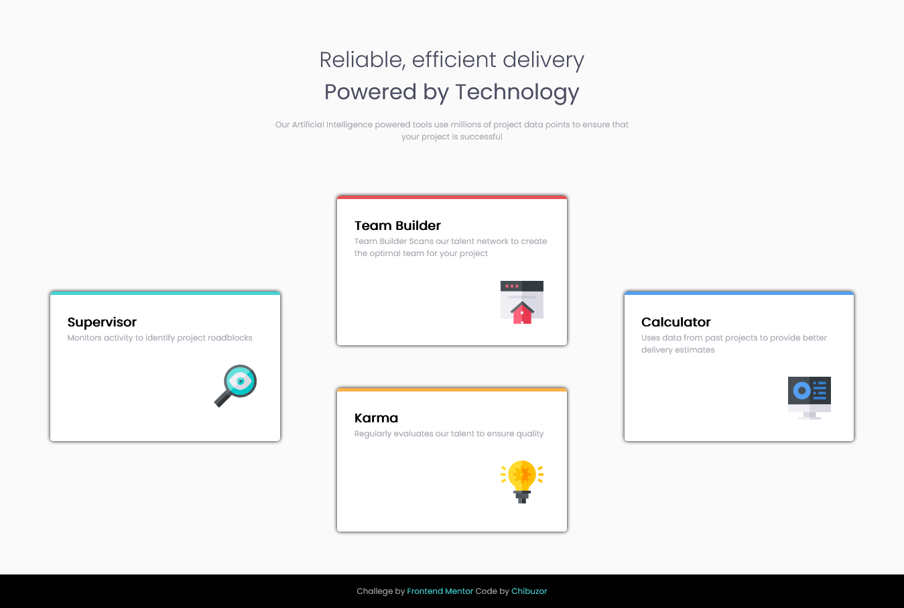

# Frontend Mentor - Four card feature section solution

This is my solution to the [Four card feature section challenge on Frontend Mentor].

* Note:there are so many ways to complete this challenge, so this is my own way of completing the challenge.

# Challenge

Users should be able to:

- View the optimal layout for the site depending on their device's screen size

# Screenshot




# Links

- My Solution URL: https://github.com/PRAISE-C24/Four-Card
- Live Site URL: https://praise-c24.github.io/Four-Card/

# Built with

- Semantic HTML5 markup
- Css
- CSS Grid
- Css flex-box
- Mobile-first workflow


# What I learned
I learned how to make the web resposive.

And I also learned how flexible it is to span columns and rows;
 to fit in to a desired layer using the Css Grid system.

my css magic code!
```css
@media screen and (min-width:900px){
    .box{
        width: 80%;
    }
    .box-1{
        grid-row: 2/4;
        grid-column: 1/2;
    }
       
    .box-2{
        grid-column-start: 2;
        grid-row: 1/3;
    }
    .box-3 {
        grid-row: 3/5;
        grid-column:2/3;
    }
    .box-4 {
        grid-row: 2/4;
        grid-column:3/4 ;
    }
}
```

# Useful resources

- Css-tricks.com : https://css-tricks.com/snippets/css/complete-guide-grid/ - the Css-tricks helped me understand some of the grid properties. I really liked this pattern and will use it going forward.

## Author

- Name - PRAISE CHIBUZOR
- Twitter - @PRAISE_C24
- Frontend Mentor - @PAISE-C24 (https://www.frontendmentor.io/profile/PRAISE-C24)


